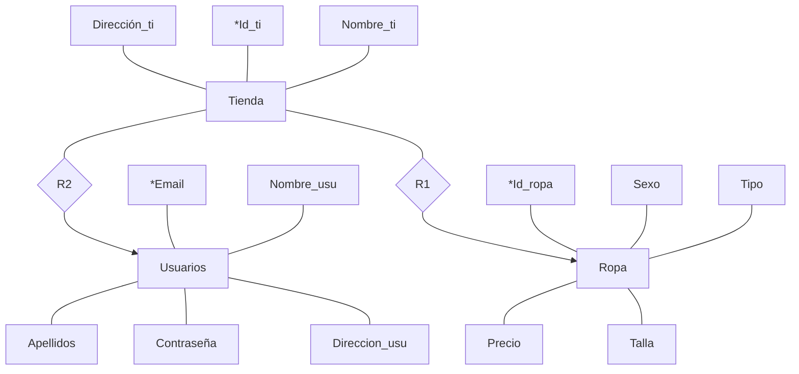

# ESCONY
**Se trata de una página web de ropa donde los usuarios podrán encontrar las prendas de ropa actuales a la venta. Algunas estarán disponibles únicamente online y otras sí que estarán también en tienda. El usuario si lo desea también podrá comprarlas desde esa misma página**
****
-   Miembros del equipo de desarrollo definitivo:
    

Rafael Serrano Algar

Lydia Muñoz Gallardo

## Diagrama entidad/relación
Atributos marcados con * son la clave.
**R1: tiene**
**R2: tiene**

